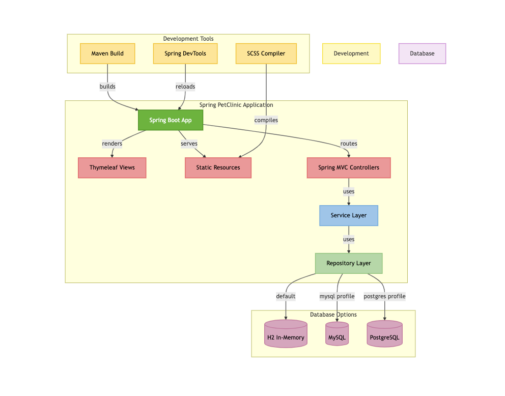

# Proyecto Final DevOps: PetClinic

## 📄 ¿Qué es PetClinic?

PetClinic es una aplicación web construida con Spring Boot que simula la gestión de una clínica veterinaria. Permite registrar dueños, mascotas y sus visitas mediante una interfaz web intuitiva. Utiliza una arquitectura basada en el patrón MVC, persistencia con Spring Data JPA y una base de datos relacional MySQL.

Esta aplicación es usada ampliamente con fines educativos para aprender el ecosistema Spring y se ha convertido en un proyecto de referencia para prácticas DevOps modernas.

---

## 🧱 Arquitectura General



---
## ⚖️ Tecnologías Utilizadas
- Java 21 (Spring Boot)
- Maven
- Docker
- Docker Compose
- Prometheus
- Grafana
- Jaeger
- OpenTelemetry
- GitHub Actions
- Helm
- Minikube (Kubernetes local)

---

## 🔄 Arquitectura

```
                        +--------------------+
                        |    GitHub Repo     |
                        | (CI/CD con Actions)|
                        +---------+----------+
                                  |
                                  v
+-----------------+     +------------------+     +------------------+
|   Prometheus    |<----|  OTEL Collector  |<----|  PetClinic App   |
|                 |     | (8889)           |     | (Java + OTEL)    |
+-----------------+     +------------------+     +------------------+
      ^                                |
      |                                v
+-------------+              +------------------+
|   Grafana   |<-------------|     Jaeger       |
+-------------+              +------------------+
```

---

## 📅 Requisitos Previos
- Docker y Docker Compose instalados
- Git
- Helm
- Minikube
- Cuenta de GitHub
- Cuenta de Docker Hub (para CI/CD)


---

## 📚 Documentación del Proyecto
- [Despliegue](./docs/01-deploy.md)
- [Runbooks](./docs/02-runbook.md)
- [Monitoring](./docs/03-monitoring.md)

---

## 📦 Despliegue Local con Docker Compose

### 1. Clona el repositorio:
```bash
git clone https://github.com/TU_USUARIO/petclinic.git
cd petclinic
```

### 2. Levanta el stack de monitorización:
```bash
docker compose -f docker-compose.monitor.yml up -d
```

### 3. Levanta la aplicación:
```bash
docker compose -f docker-compose.yml up -d --build
```

### 4. Accede a los servicios:
- Aplicación: http://localhost:8080
- Prometheus: http://localhost:9090
- Grafana: http://localhost:3000
- Jaeger: http://localhost:16686

---

## 🌍 Despliegue con Helm en Minikube

### 1. Inicia Minikube
```bash
minikube start --driver=docker
```

### 2. Aplica el despliegue de MySQL (si usas Kubernetes en vez de Docker Compose)
```bash
kubectl apply -f helm/k8s/mysql-deployment.yaml
```

### 3. Instala el chart de Helm
```bash
helm install petclinic ./helm
```

### 4. Abre la app con port-forward
```bash
kubectl port-forward service/petclinic-svc 8081:8080
```
Luego abre: http://localhost:8081

---

## 💳 CI/CD con GitHub Actions

El repositorio incluye un pipeline GitHub Actions que:
- Compila y testea la aplicación con Maven
- Construye una imagen Docker
- Inicia sesión en Docker Hub
- Etiqueta y sube la imagen como `latest`

La imagen final puede encontrarse en: https://hub.docker.com/r/pattfc/petclinic/tags

---

## 💡 Runbook de Incidentes

| Incidente                          | Acción recomendada                              |
|-----------------------------------|--------------------------------------------------|
| App no conecta a MySQL            | Verifica logs de `petclinic-app` y `mysql` pod   |
| Prometheus `up = 0`               | Verifica puertos expuestos y red Docker o K8s    |
| Jaeger no muestra trazas          | Verifica que OTEL esté configurado y conectado   |
| CI/CD falla en Docker login       | Verificar secrets `DOCKER_USERNAME` y `DOCKER_PASSWORD` en GitHub |

---

## 🛡️ Seguridad: Análisis de vulnerabilidades con Trivy

Este proyecto incluye un análisis automático de seguridad en el pipeline CI/CD. Se utiliza Trivy para escanear la imagen Docker en busca de vulnerabilidades críticas o altas antes de subirla a Docker Hub.

### 📄 Resultado visible en la pestaña Actions (GitHub)

Paso relevante en `.github/workflows/ci.yml`:

```yaml
- name: Escaneo de seguridad con Trivy
  uses: aquasecurity/trivy-action@master
  with:
    scan-type: image
    image-ref: petclinic-app
    format: table
    severity: CRITICAL,HIGH
```

---

## 💼 Autora
- Patricia Fernández Caballero
- Proyecto para el Bootcamp DevOps II de Código Facilito

---

## ✅ Estado del Proyecto
- [x] Docker Compose app + MySQL
- [x] Observabilidad: Prometheus, Jaeger, OTEL
- [x] CI/CD: GitHub Actions + Docker Hub
- [x] Helm + Kubernetes (Minikube)
- [x] Seguridad (trivy, secrets avanzados)
- [x] Red documentada y funcional


