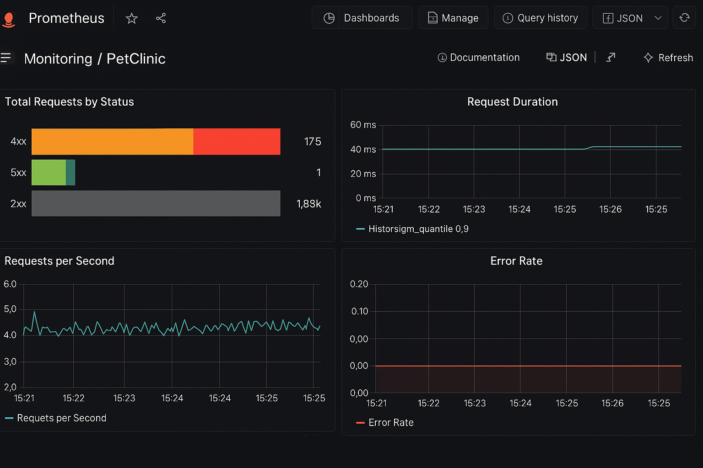
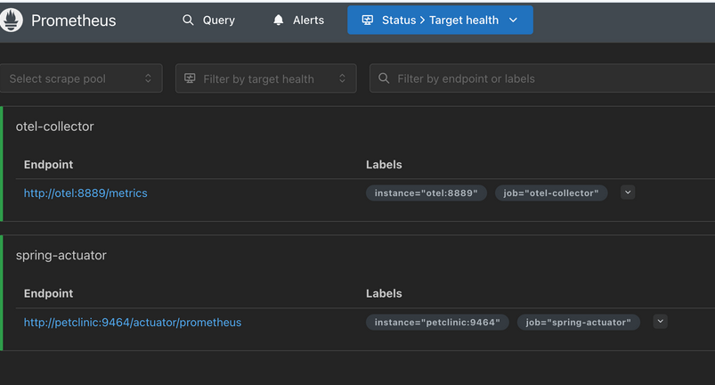
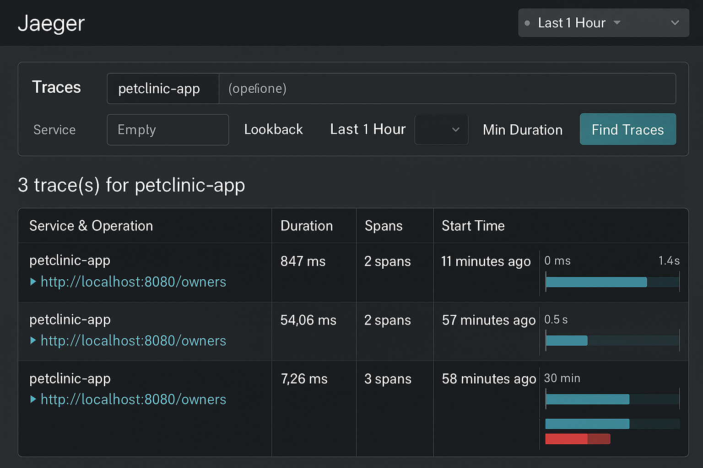
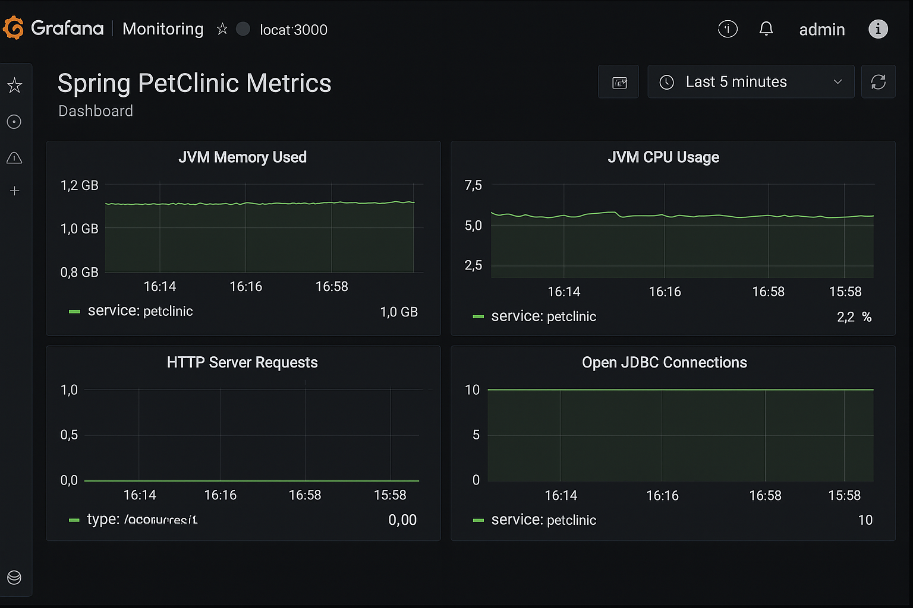

# 🧭 Observabilidad del Proyecto PetClinic

Este documento describe brevemente cómo se ha implementado la observabilidad de la aplicación PetClinic en el entorno del proyecto DevOps.

## 📊 Prometheus

Prometheus se encarga de recolectar métricas de la aplicación y exponerlas para visualización.

- Las métricas se obtienen vía OpenTelemetry (OTLP) y Spring Actuator.
- Puerto expuesto por el collector: `8889`
- Las métricas pueden incluir:
  - Recuento de peticiones HTTP
  - Duración promedio de peticiones
  - Estado de endpoints

📸 


---

## 🔍 Jaeger

Jaeger permite visualizar trazas distribuidas para entender cómo se comportan las llamadas dentro de la aplicación.

- Recibe trazas desde el agente OTEL
- Visualiza el flujo entre controladores y servicios de Spring Boot
- Muy útil para detectar latencias o errores distribuidos

📸 

---

## 📈 Grafana

Grafana se ha configurado para mostrar paneles visuales con métricas clave del sistema.

- Se utiliza Prometheus como fuente de datos
- Paneles incluyen:
  - Recuento de peticiones HTTP
  - Duración promedio
  - Por endpoint y método

📸 

---

## 📦 Herramientas involucradas

- **Prometheus**: recolector de métricas
- **Grafana**: visualización de métricas
- **Jaeger**: trazas distribuidas
- **OpenTelemetry**: instrumentación de la app Java
- **Spring Actuator**: exposición de métricas y endpoints internos

---

## 📝 Observaciones

- Las herramientas de observabilidad se pueden iniciar con:
```bash
docker compose -f docker-compose.monitor.yml up -d
```

- Todos los servicios están asociados a una red Docker llamada `petclinic-net`.

---

